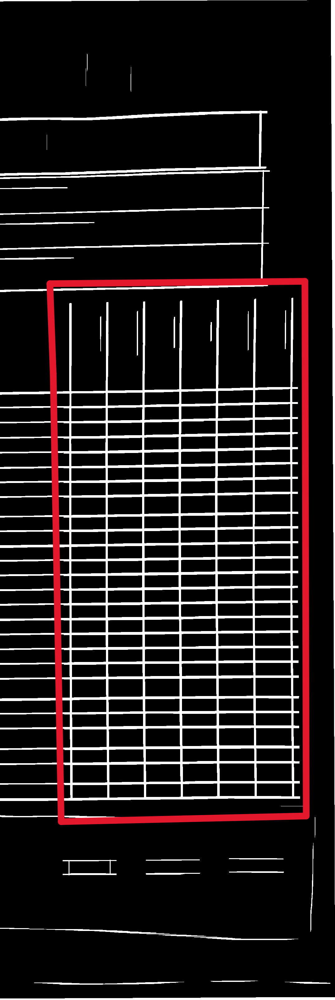

# Projet Bureau d'Etude Technique
## Correction automatique des grilles de stage
Ce répertoire contient le code source du projet technique dédié à la **correction automatique des grilles de stage**.

<p align="center">
</p>

---

### Interface utilisateur


### Exemple d’image

Voici une image utilisée comme exemple pour illustrer les différentes étapes du traitement :


---

### Modifications apportées à la grille

Afin de faciliter le traitement automatique, nous avons modifié la grille comme suit :

- Ajout d’un **code QR** contenant :
  - le **type de grille**,
  - le **nombre de lignes**,
  - le **nombre de colonnes**.
- Les lignes sont plus epaisses.

Utilisation de cette image pour démontrer le fonctionnement du système étape par étape.

### Remarque

> Le code QR de cette image contient volontairement une **erreur** : il indique **28 lignes** alors qu’il y en a en réalité **26**.  
> Cette incohérence a été utile pour tester le traitement automatique et l'interface utilisateur,


## 1. Prétraitement de l'image

Avant toute analyse, l'image subit un ensemble de transformations afin d'améliorer la lisibilité et la robustesse du traitement :

---

### 1.1. Détection du type de grille & redressement

Un **QR code** est intégré dans la grille pour encoder :
- Le type de grille
- Le nombre de lignes et de colonnes

Cela permet de corriger automatiquement l'inclinaison de l'image et d'adapter le traitement à la grille scannée.

---

### 1.2. Conversion en niveaux de gris

La première étape visuelle consiste à convertir l'image couleur en **niveau de gris**, ce qui simplifie les traitements suivants :


---

### 1.3. Binarisation adaptative

L’image en niveaux de gris est ensuite **binarisée** grâce à un seuillage local, qui s’adapte aux variations d’éclairage.  
On utilise la méthode `ADAPTIVE_THRESH_GAUSSIAN_C` de OpenCV avec les paramètres suivants :

- **Méthode** : Moyenne pondérée avec une distribution gaussienne
- **Taille de fenêtre** : 51 pixels (zone locale analysée autour de chaque pixel)
- **Valeur soustraite** : 5 (ajuste finement le seuil)

Cela produit une image en noir et blanc plus robuste, même en cas d’éclairage inégal :


---

### 1.4. Filtrage & inversion

L'image est ensuite **inversée** (noir ⇄ blanc) pour faciliter les détections de lignes et coches.  
On applique aussi un **filtrage** pour réduire les petits bruits indésirables.


---

## 2. Extraction des lignes et colonnes

Une fois l’image prétraitée, on passe à la détection de la structure de la grille, c’est-à-dire les lignes horizontales et verticales.

---

### 2.1. Détection des lignes horizontales

L'objectif est d'isoler uniquement les lignes horizontales de la grille à l'aide d'opérations morphologiques :

---

####    Érosion horizontale

- **Élément structurant** : un rectangle fin et large → `(1, 7)` (inversé dans le code)
- **Opération** : Érosion, pour réduire les éléments fins verticaux et ne garder que les horizontaux
- **Itérations** : 8

Cela permet d'effacer les petites perturbations et de renforcer la structure horizontale.

Résultat :


---

#### Dilatation horizontale

- **Élément structurant** : identique → `(1, 7)`
- **Opération** : Dilatation, pour reconstituer les lignes horizontales après érosion
- **Itérations** : 14

Cette étape reconstruit les lignes nettes sur l’image en supprimant les résidus indésirables.

Résultat :


### 2.2. Détection des lignes verticales

De la même manière que pour les lignes horizontales, nous procédons à l'extraction des lignes verticales à l'aide d'opérations morphologiques :

---

#### Érosion verticale

- **Élément structurant** : un rectangle étroit et long → `(7, 1)` (inversé dans le code)
- **Opération** : Érosion, pour réduire les éléments fins horizontaux et ne garder que les verticaux
- **Itérations** : 8

Cela permet de réduire les éléments non-pertinents et de préserver uniquement la structure verticale.

Résultat :


---

#### Dilatation verticale

- **Élément structurant** : identique → `(7, 1)`
- **Opération** : Dilatation, pour reconstruire les lignes verticales après l’érosion
- **Itérations** : 8

Cette étape permet de redonner aux lignes verticales leur pleine largeur.

Résultat :


#### Combinaison des deux images avec un OU logique:

Résultat : 


## 3. Extraction des Cellules

### 3.1 Préparation de la Zone de Travail
#### Isolation de la Moitié Droite
- **Objectif** : Éliminer les éléments non pertinents à gauche de la grille
- **Méthode** : Découpage vertical au milieu de l'image
- **Résultat** : Concentration sur la partie contenant les cellules


---

### 3.2 Détection du Cadre Principal (plus grand contour)
#### Identification du Rectangle Dominant
- **Technique** : 
  - Détection des contours externes
  - Sélection par surface maximale

  En trouvant le plus grand contours, nous pouvons ensuites exploiter les coordonnées du rectangles qui l'englobe pour mieux affiner l'analyse
- **Paramètres** : Approximation polygonale à 2% de précision




---

### 3.3 Optimisation des Lignes
#### Amincissement des Traits
- **Algorithme** : Zhang-Suen (thinning)
- **Effet** : 
  - Réduction d'épaisseur des lignes à 1px
  - Séparation claire des cellules adjacentes


---

### 3.4 Extraction des Contours Internes
#### Détection Multi-échelle
- **Mode** : RETR_LIST pour tous les contours
- **Filtrage** :
  - Forme rectangulaire (4 côtés)
  - Surface dans ±45% de la médiane
  - Tolérance d'approximation : 10%
#### Justification de la tolérance (±45% de la médiane)

Une tolérance large permet d’accepter les cellules dont la taille varie à cause :
- des déformations lors de la prise de vue (inclinaison, perspective),
- des petites irrégularités d'impression ou de découpe.

Ce seuil a été fixé empiriquement pour :
- maximiser la détection des vraies cellules,
- exclure les éléments trop petits (bruit) ou trop grands (cadres).

```python
# Extraits clés (montrés pour illustration)
tolerance = 0.45
approximation = 0.1 * cv2.arcLength(contour, True)
```

---

# 4. Détection des Croix de Vérification

### 4.1. Suppression des Lignes Résiduelles
#### Élimination des Lignes Verticales
- **Objectif** : Isoler les croix des cellules
- **Méthode** : Soustraction des lignes verticales détectées
- **Résultat** : Conservation uniquement des éléments non-structuraux


---

### 4.2. Découpage de la Zone d'Intérêt
#### Isolation de la Région Active
- **Cible** : Partie droite contenant les réponses
- **Coordonnées** : Basées sur le cadre principal détecté
- **Précision** : Ajustement selon la première cellule


---

### 4.3. Nettoyage Morphologique
#### Ouverture pour Suppression du Bruit
- **Noyau** : 3x3 pixels
- **Effet** : 
  - Élimination des petits artefacts
  - Lissage des contours irréguliers


---

### 4.4. Reconnexion des Éléments
#### Dilatation Horizontale
- **But** : Reconnecter les parties disjointes des croix
- **Paramètres** : 
  - Noyau horizontal (1x7)
  - 3 itérations


---

### 4.5. Filtrage des Lignes Horizontales Résiduelles
#### Masquage Sélectif
- **Technique** : Soustraction des lignes horizontales
- **Précision** : Conservation des formes angulaires

| Masque Horizontal | Résultat après soustraction |
|-------------------|-----------------------------|
|  |  |

---

### 4.6. Amélioration de la Qualité
#### Post-traitement Morphologique
1. **Fermeture** (5x5) : Combler les micro-interruptions  
2. **Ouverture** (3x3) : Affiner les contours

| Avant | Après |
|-------|-------|
|  |  |

---

### 4.7. Filtrage Final
#### Combinaison Logique AND avec l'image binaire inversée
- **Objectif** : Éliminer les faux positifs
- **Méthode** : Intersection avec l'image inversée originale


---

### 4.8. Détection des croix
#### Extraction des Contours Valides
- **Critères** : 
  - Surface > 175 pixels²
  - Forme compacte
  - Position intra-cellule


